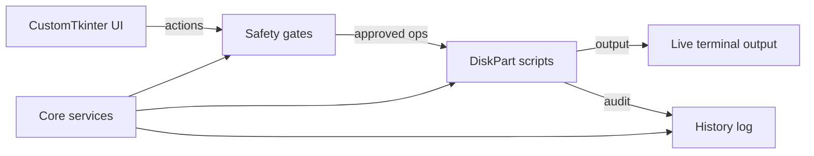

# DiskWizard
Production-grade Windows GUI utility for DiskPart operations.

DiskWizard is a safe, beginner-friendly desktop tool that wraps DiskPart in a modern CustomTkinter UI. It emphasizes guardrails, auditability, and clear feedback so destructive operations are always intentional.

## Why DiskWizard
- Surgical, industrial UI focused on clarity and confidence
- Safety gates that block system disk operations
- Confirmation workflows for destructive actions
- Live streaming terminal output
- JSON history log with export support

## Features
- Drive discovery via WMI with fallback paths
- Disk 0 is permanently blocked from destructive actions
- Clean, quick format, partition, convert MBR/GPT, assign letter
- Bootable USB creation from ISO
- DiskPart scripts always run from temp files with audit trail
- Operation history saved under %APPDATA%\DiskWizard\history.json

## Screens
Add screenshots to a docs/ folder and link them here.

## Tech Stack
- Python 3.11+
- CustomTkinter
- WMI + psutil
- PyInstaller

## Project Layout
```
DiskWizard/
├── main.py
├── requirements.txt
├── DiskWizard.spec
├── assets/
│   └── fonts/
├── core/
├── ui/
└── utils/
```

## Architecture


## Setup
```
pip install -r requirements.txt
python main.py
```

Note: The app requires admin privileges and will prompt for UAC elevation on launch.

## Build
```
pyinstaller DiskWizard.spec
```

The executable is produced at dist/DiskWizard.exe and will request UAC on launch.

## Safety Notes
- Disk 0 is always blocked.
- Destructive actions require a confirmation checkbox.
- DiskPart is executed only through script files.
- UI updates from background threads are marshaled through the UI thread.

## License
Specify your license here.
